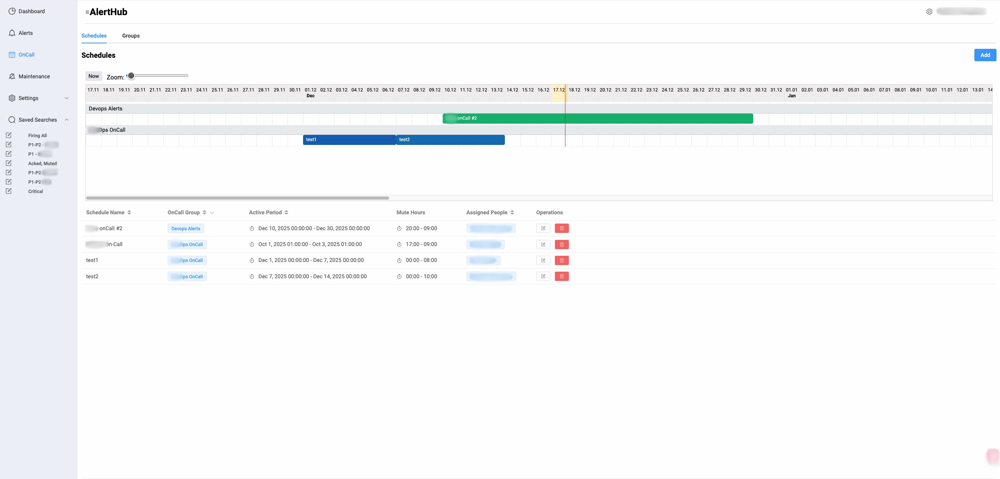
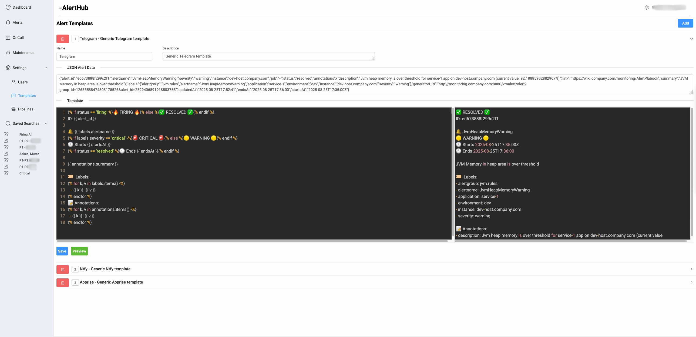
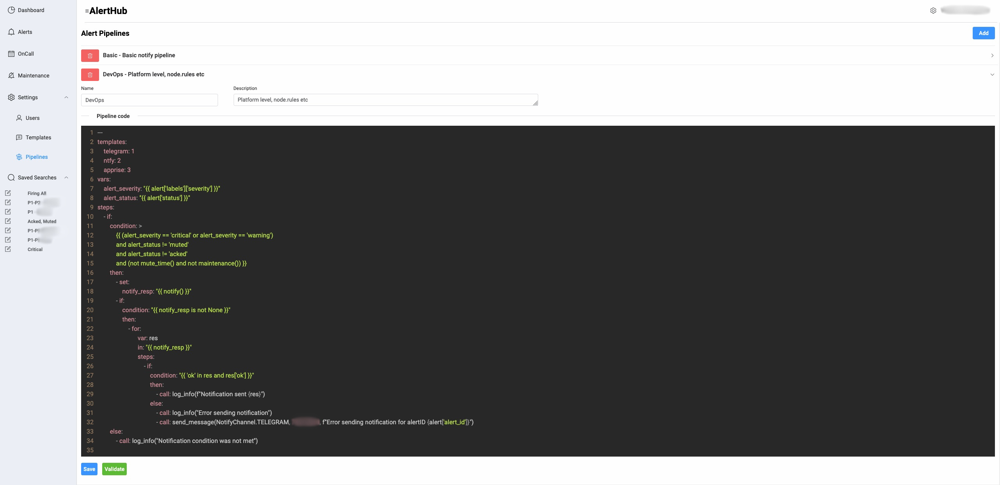
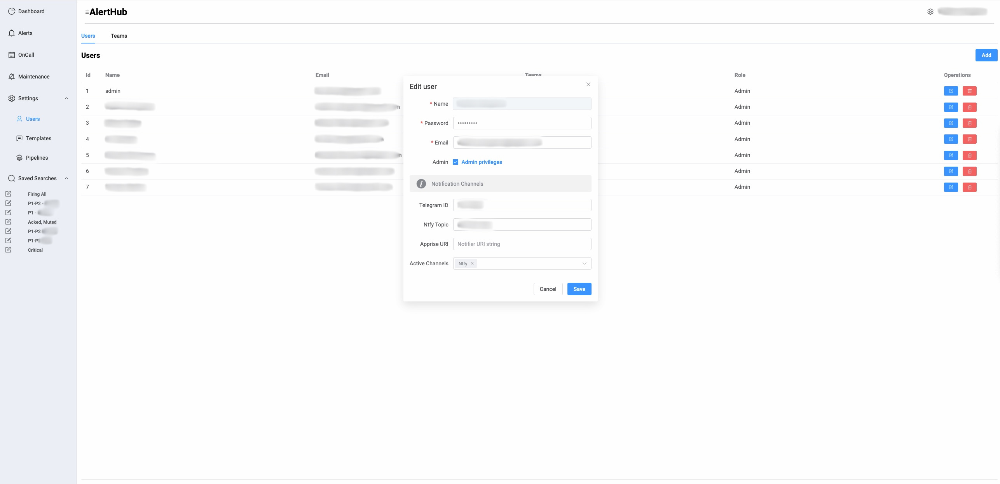
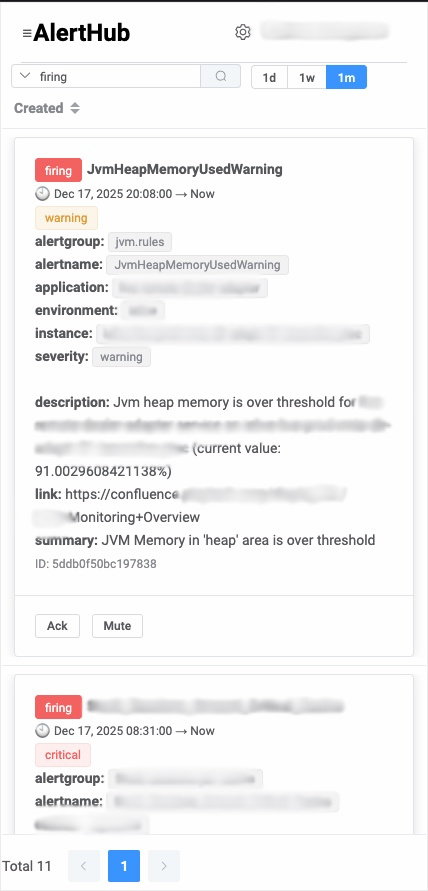

# AlertHub

## Overview

AlertHub is a simple alert management system with on-call scheduler that receives alerts from Prometheus Alertmanager, processes them through configurable pipelines, and routes notifications to various notification channels. 
## Key Features

### 🚨 Alert Reception & Processing
- **Alertmanager Webhook Integration**: Receives alerts via standard Prometheus Alertmanager webhooks
- **Real-time Processing**: Processes alerts immediately upon receipt using configurable pipelines
- **Alert History**: Maintains complete audit trail of alert status changes and user actions

### 🔄 Alert Pipeline System
- **YAML-based Pipelines**: Define alert processing logic using intuitive YAML syntax
- **Conditional Routing**: Route alerts based on severity, status, labels, and custom conditions
- **Template System**: Use Jinja2 templates for message formatting across different notification channels
- **Built-in Functions**: Access to helper functions for mute time checks, maintenance windows, and notifications

### 📱 Multi-Channel Notifications
- **Telegram Bot**: Send formatted alerts to Telegram groups/channels
- **Ntfy Server**: Push notifications to Ntfy topics
- **Apprise Integration**: Support for 80+ notification services via Apprise
- **Custom Templates**: Different message formats for each notification channel

### 🕐 Scheduling & Maintenance
- **Team Management**: Organize users into teams for coordinated alert handling
- **Personal Preferences**: Individual per-user notification settings and timezones
- **On-Call Scheduling**: Define rotation schedules and duty assignments
- **Maintenance Windows**: Define periods when alerts should be suppressed
- **Mute Time Rules**: Time-based alert suppression (e.g., after-hours)

### 🌐 Web Interface
- **Real-time Dashboard**: Live alert updates via WebSocket connections
- **Alert History**: Search and filter through past alerts (PostgreSQL Full-text Search query format)
- **Status Management**: Acknowledge, mute, delete alerts
- **Search & Filters**: Save custom search queries for quick access


## Quick Start

### Prerequisites
- Python 3.8+
- PostgreSQL 12+
- Node.js 16+
- npm or yarn

### Installation

1. **Clone the repository**
   ```bash
   git clone <repository-url>
   cd alerthub
   ```

2. **Backend Setup**
   ```bash
   # Install Python dependencies
   pip install -r requirements.txt
   
   # Configure database connection in config.py
   # Set up PostgreSQL database and user
   ```

3. **Frontend Setup**
   ```bash
   cd web
   npm install
   npm run build
   cd ..
   ```

4. **Run the Application**
   ```bash
   python server.py
   ```

5. **Access the Web Interface**
   Open `http://localhost:5000` in your browser

### Configuration

Edit `config.py` to customize:
- Database connection settings
- JWT secret and token expiration
- Notification service credentials (Telegram, Ntfy, etc.)
- Server listening address and port
- Timezone settings

## Usage

### Setting Up Alertmanager

Add this receiver to your Alertmanager configuration:

```yaml
receivers:
  - name: 'alerthub'
    webhook_configs:
      - url: 'http://your-alerthub-server:5000/alertmanager'
```

### Expected alert schema
~~~json
{
  "alert_id": "",
  "alertname": "",
  "severity": "",
  "instance": "",
  "job": "",
  "status": "",
  "annotations": {
    "description": "",
    "link": "",
    "summary": "",
    ....
  },
  "labels": {
    "alertgroup": "",
    "alertname": "",
    "application": "",
    "environment": "",
    "instance": "",
    "severity": "",
    ....
  },
  "generatorURL": "",
  "updatedAt": "",
  "endsAt": "",
  "startsAt": ""
}
~~~

## Screenshots

### Alerts


### Schedules


### Notification templates


### Alert pipeline


### Users


### Mobile view

